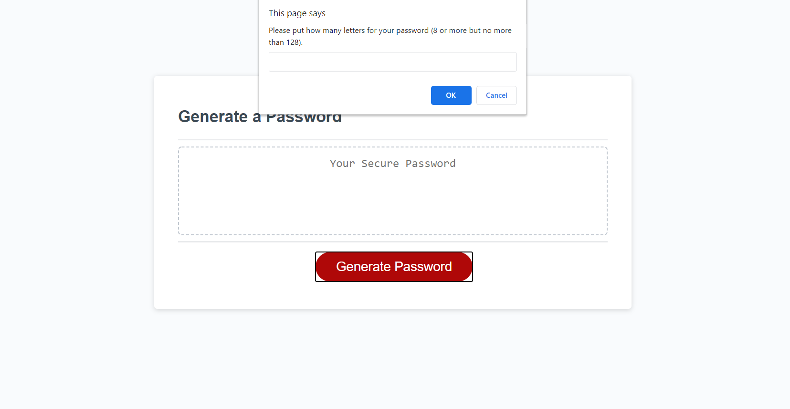
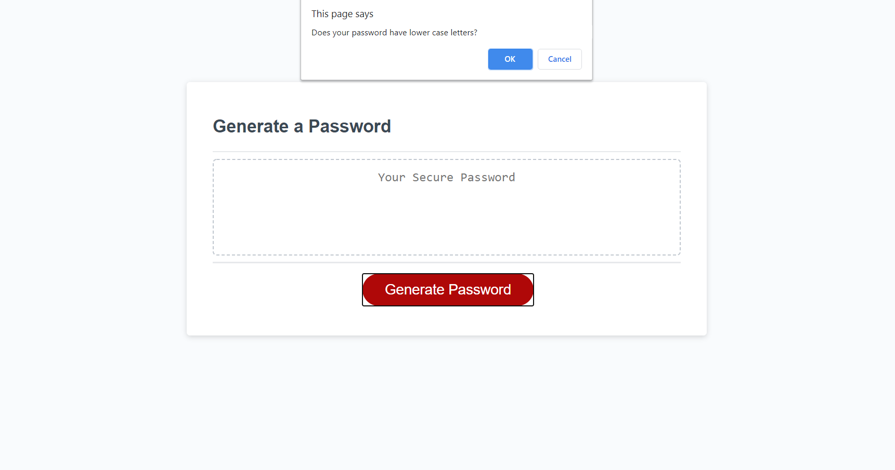
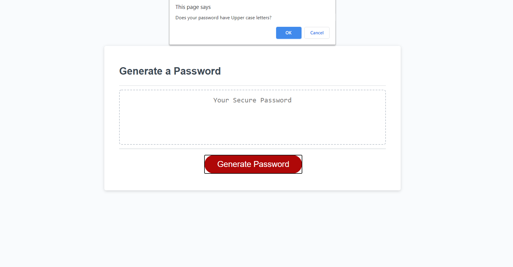
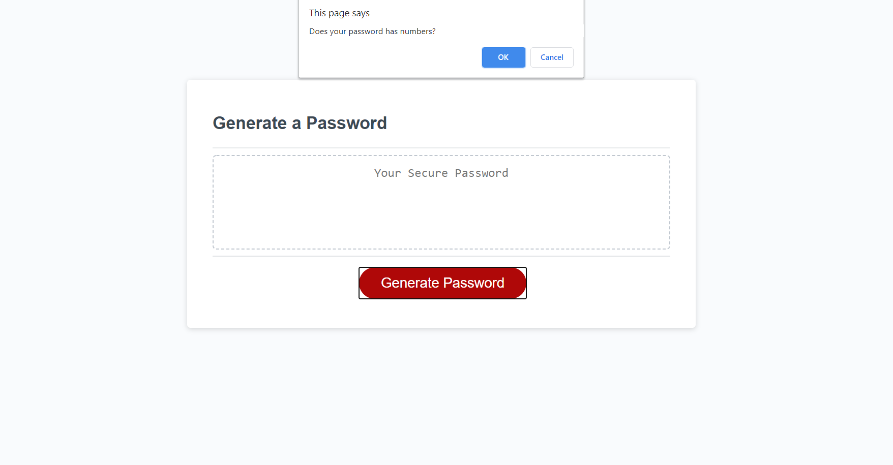
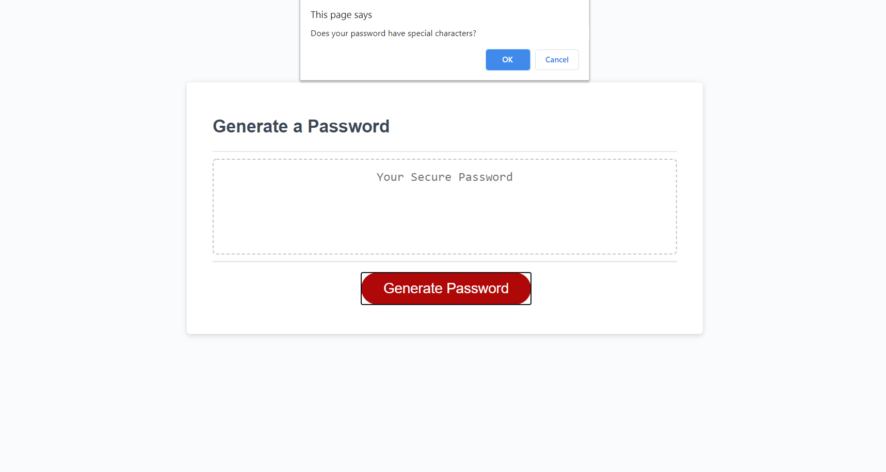
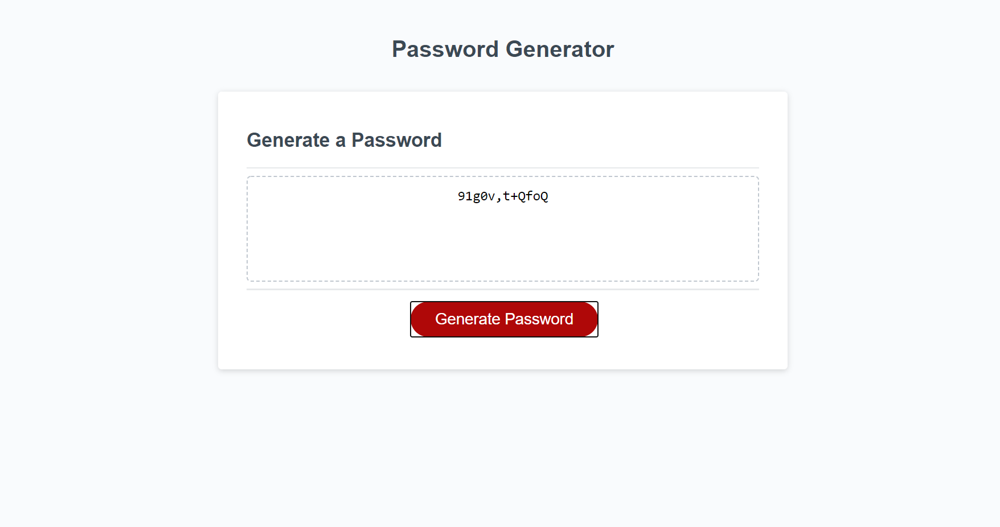

# Password_Generator
This is a random number generated password generator. When the user click on the Generate Password Button,

it will ask a series of questions about the user's preference for their new password. After all the questions

have been answered, the middle box will display the password based on user's choice.

# Instruction
STEP 1.

Click the Generate Password Button.

Step 2.

User will input how long the password they would like.

Step 3.

Select if the password includes lowercase letters or no. Click ok if the password has lowercase letters, else select cancel to skip the option.

Step 4.

Select if the password includes uppercase letters or no. Click ok if the password has uppercase letters, else select cancel to skip the option.

Step 5.

Select if the password includes number or no. Click ok if the password has number, else select cancel to skip the option.

Step 6.

Select if the password includes special characters or no. Click ok if the password has special characters, else select cancel to skip the option.

Step 7.

The box in the the center will display the user's new password after completing all the prompt.

# Deployment

[Password Generator](https://esaucey.github.io/Password_Generator/)
